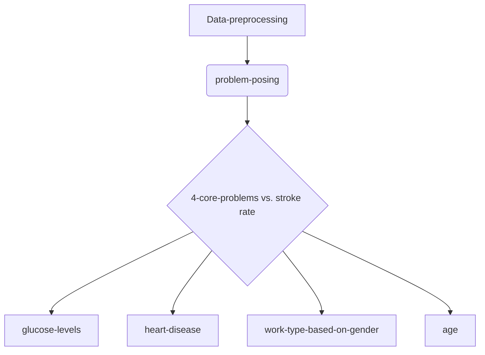

# Team 5's final project 

## Topic
Study on multiple factors affecting stroke rate 

## Project
 This is the website for our final project
 https://janin-w-team-5-project-app-qz6tf1.streamlitapp.com/

### Team members
 Xinyu Chen   Yanan Wen

## Project process

### Project content
Using stroke-related data from a sample survey, the app analyzes and characterizes factors associated with stroke, including blood sugar level, gender, age, and job type. Through interaction, the interaction between factors can be more visually and clearly illustrated. Users can understand these through interaction.